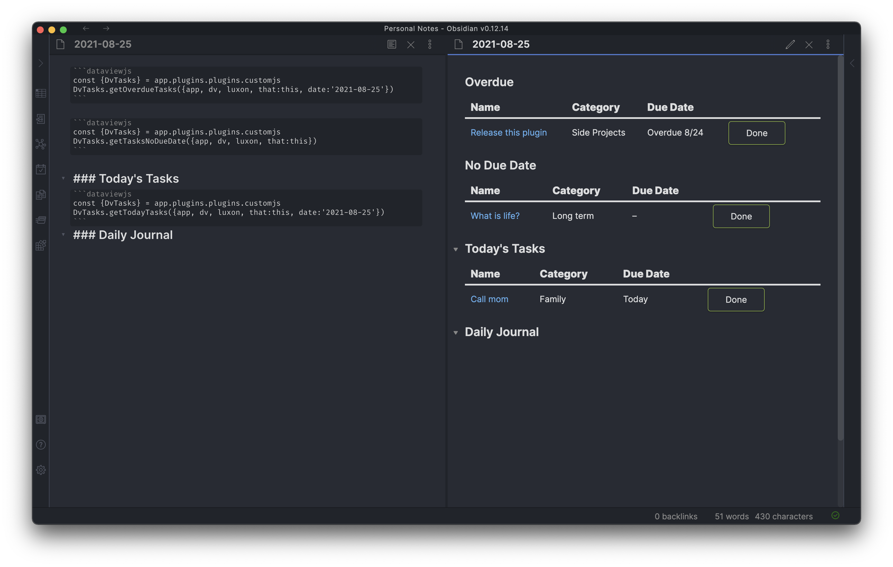

# CustomJS

CustomJS is a plugin for Obsidian that allows users to write custom Javascript that you can call anywhere you can write JS — including `dataviewjs` blocks and templater templates.

✅ Works on desktop and mobile!

## Installation

#### Recommended

CustomJS is available in the Obsidian community plugin browser.

#### Manual

Go to the [releases](https://github.com/samlewis0602/obsidian-custom-js/releases) and download the latest `main.js` and `manifest.json` files. Create a folder called `customjs` inside `.obsidian/plugins` and place both files in it.

## Settings

Tell CustomJS what code to load.
NOTE: only use forward slashes in your paths, back slashes will break non-windows platforms.

### Individual files

A comma-separated list of files you'd like to load.

### Folder

Path to a folder that contains JS files you'd like to load. The folder setting will load all `*.js` files in that folder **recursively**. So setting `scripts` will load `scripts/a.js` and `scripts/other/b.js`.

> ⚠️ Files are loaded in alphabetical order by **_file name_** for consistency, enabling dependencies on each other.

### Registered invocable scripts

Allows you to bind an [Invocable Script](#invocable-scripts) to a hotkey.

### Startup scripts

[Invocable Scripts](#invocable-scripts) executed when the plugin is loaded. You may want use it to initialize something when Obsidian is loaded.

> ⚠️ Changes made in the `Startup scripts` to the `window.customJS` object might get overridden. To avoid that follow [State](#state) tips.

## Usage/Example

CustomJS works by writing javascript classes. Each file can only contain one class.

````
// in vault at scripts/coolString.js
class CoolString {
    coolify(s) {
        return `😎 ${s} 😎`
    }
}


// dataviewjs block in *.md
```dataviewjs
const {CoolString} = customJS
dv.list(dv.pages().file.name.map(n => CoolString.coolify(n)))
```

// templater template
<%*
const {CoolString} = customJS;
tR += CoolString.coolify(tp.file.title);
%>
````

Make sure you add `scripts/coolString.js` to the settings page for CustomJS and voila! When entering preview mode for the dataviewjs block you should see a list of all your files with a little extra 😎 — inserting the templater template will output a similar result with just the current file name.

## Advanced example

You can pass anything as parameters to your functions to allow for some incredible code reuse. A dataview example that I use to manage tasks:

#### Daily note

````
```dataviewjs
const {DvTasks} = customJS
DvTasks.getOverdueTasks({app, dv, luxon, that:this, date:'2021-08-25'})
```

```dataviewjs
const {DvTasks} = customJS
DvTasks.getTasksNoDueDate({app, dv, luxon, that:this})
```

### Today's Tasks
```dataviewjs
const {DvTasks} = customJS
DvTasks.getTodayTasks({app, dv, luxon, that:this, date:'2021-08-25'})
```
### Daily Journal
````

#### scripts/dvTasks.js

```
class DvTasks {
  relDateString(d, luxon) {
    if (!(d instanceof luxon.DateTime)) return '–'
    const now = luxon.DateTime.now()
    const days = Math.ceil(d.diff(now, 'days').days)
    if (days < 0) return 'Overdue ' + d.toFormat('L/d')
    if (days === 0) return 'Today'
    if (days === 1) return 'Tomorrow'
    if (days < 7) return d.toFormat('cccc')
    return d.toFormat('ccc L/d')
  }

  getButtonStrings(status) {
    const completed = status === 'Completed'
    const btnStr = completed ? 'Undo' : 'Done'
    const updateStr = completed ? 'To-Do' : 'Completed'
    return { btnStr, updateStr }
  }

  getCustomLink(name, target) {
    return `[[${target}|${name}]]`
  }

  getTodayTasks(args) {
    const { luxon, dv, date, that } = args
    const finalDate = date ?? dv.current().file.name
    return this.getTasksTable({
      ...args,
      filterFn: t => t.status != 'Completed' && t.dueDate && t.dueDate?.hasSame(luxon.DateTime.fromISO(finalDate), 'day')
    })
  }

  getOverdueTasks(args) {
    const { luxon, dv, date, that } = args
    const finalDate = date ?? dv.current().file.name
    return this.getTasksTable({
      ...args,
      prependText: 'Overdue',
      filterFn: t => t.dueDate && t.dueDate < luxon.DateTime.fromISO(finalDate) && t.status != 'Completed'
    })
  }

  getTasksNoDueDate(args) {
    return this.getTasksTable({
      ...args,
      prependText: 'No Due Date',
      filterFn: t => !t.dueDate
    })
  }

  getTasksTable(args) {
    const {
      that,
      app,
      dv,
      luxon,
      getSortProp = t => t.dueDate,
      sortOrder = 'asc',
      filterFn = t => t.task,
      completedCol = false,
      prependHeaderLevel = 3,
      prependText
    } = args;
    const { metaedit, buttons } = app.plugins.plugins
    const { update } = metaedit.api
    const { createButton } = buttons


    const dueStr = completedCol ? 'Completed' : 'Due Date';
    const pages = dv.pages("#task").sort(getSortProp, sortOrder).where(filterFn)
    if (pages.length === 0) {
      // console.log('Empty dataview:', args)
      return
    }

    if (prependText) {
      dv.header(prependHeaderLevel, prependText)
    }

    dv.table(["Name", "Category", dueStr, "", ""], pages
      .map(t => {
        const { btnStr, updateStr } = this.getButtonStrings(t.status)
        return [
          this.getCustomLink(t.task, t.file.name),
          t.category,
          this.relDateString(t.dueDate, luxon),
          createButton({
            app,
            el: that.container,
            args: { name: btnStr },
            clickOverride: { click: update, params: ['Status', updateStr, t.file.path] }
          }),
        ]
      })
    )
  }
}
```

#### Result



### Asynchronous Usage

CustomJS loads your modules at Obsidian's startup by hooking an event that says that Obsidian is ready. This is an event that is used by _other_ plugins as well (such as [Templater](https://github.com/SilentVoid13/Templater) and its startup template), and unfortunately this means that if you want to use CustomJS with them there can be problems.

> `customJS` is not defined

If you see issues where the `customJS` variable is not defined, this is when you want to force it to load before your script continues. In order to allow this, we provide the asynchronous function `forceLoadCustomJS()`, also defined globally. This means that you can `await` it, thereby ensuring that `customJS` will be available when you need it.

```js
await forceLoadCustomJS();
```

That said, most of the time **_you do not need to do this_**. In the vast majority of JavaScript execution taking place within Obsidian, customJS will be loaded.

### Invocable Scripts

_Invocable Script_ is the class with the defined method

```js
async invoke() {
  ...
}
```

You can run such scripts via `CustomJS: Invoke Script` command.

Also you can register individual commands via [settings](#registered-invocable-scripts) for the desired script and invoke it via `CustomJS: MyScriptName` command. Additionally you can assign a custom hotkey for that registered commands.

### State

`window.customJS` object is being overridden every time any `js` file is modified in the vault. If you need some data to be preserved during such modifications, store them in `window.customJS.state`.

## ☕️ Support

Do you find CustomJS useful? Consider buying me a coffee to fuel updates and more useful software like this. Thank you!

<a href="https://www.buymeacoffee.com/samlewis" target="_blank"></a>

## Local development

1. Clone this repository into `<vaultpath>/.obsidian/plugins`

Note: it is recommended to use a test vault when developing plugins.

2. (if you are using node version manager, use the version from package.json -> devDependencies -> @types/node)

3. Install dependencies: `npm install`

4. Build in dev mode with `npm run dev`

NOTE: if you place your repository somewhere else than in `plugins`, you can customize the output path with

`OUTPUT_DIR=<vaultpath>/.obsidian/plugins/obsidian-custom-js npm run dev`

See also:

- Obsidian development guide: https://docs.obsidian.md/Plugins/Getting+started/Build+a+plugin
- Hot reloading plugin: https://docs.obsidian.md/Plugins/Getting+started/Development+workflow
